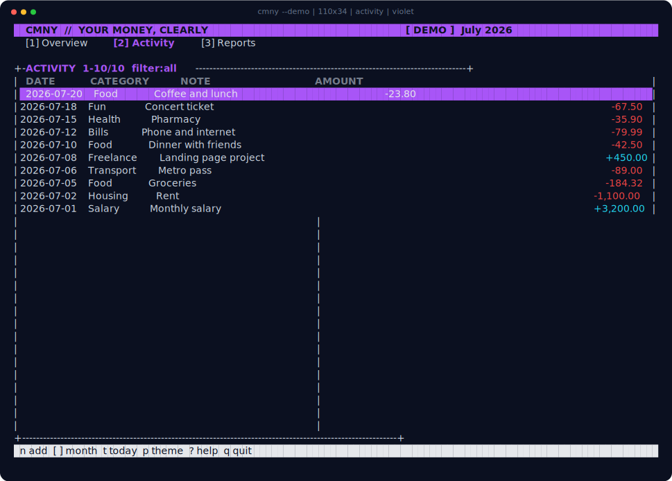

<div align="center">

# CMNY

**Your money, clearly.** A fast, private money manager for your terminal.

</div>


CMNY gives you a clean monthly view of what came in, what went out, and what
you saved. Everything works from the keyboard and stays in one local file—no
account, cloud, ads, or bank connection.

## Download

| System | Package |
|---|---|
| macOS 11+ — Apple silicon and Intel | [Download for macOS](dist/cmny-v0.1.0-macos-universal.tar.gz) |
| 64-bit Linux | [Download for Linux](dist/cmny-v0.1.0-linux-x86_64.tar.gz) |
| Windows 10/11 | [Download for Windows](dist/cmny-v0.1.0-windows-x86_64.zip) |

Extract the package, open a terminal inside its folder, and try the demo:

```sh
./cmny --demo
```

On Windows, run `.\cmny.exe --demo` instead. The packages include
[checksums](dist/SHA256SUMS) but are not yet signed or notarized; macOS may ask
you to right-click the app and choose **Open** the first time.

## What it does

- Track income and expenses with notes and categories
- Show monthly spending, savings, and a six-month trend
- Search, filter, edit, and safely confirm deletions
- Switch between Ocean, Violet, and Amber themes
- Fit wide, compact, and resized terminals smoothly
- Keep real data separate from the built-in demo



## Controls

| Key | Action |
|---|---|
| `1` `2` `3` | Overview, activity, reports |
| `n` | Add a transaction |
| `[` `]` | Previous or next month |
| `↑` `↓` | Move through activity |
| `Enter` | View a transaction |
| `e` `d` | Edit or delete |
| `/` | Search |
| `f` | Filter income and expenses |
| `p` | Change theme |
| `?` | Help |
| `q` | Quit |

Start in a favorite theme with `cmny --theme violet`, or set
`CMNY_THEME=amber` in your shell profile.

## Your data

Run `cmny` without `--demo` to create your real ledger. Use `cmny --db-path`
to see exactly where it lives, then copy that file whenever you want a backup.

The ledger is private to your operating-system account, but it is **not
encrypted**. Use device encryption for sensitive data, never run CMNY with
`sudo` or as Administrator, and open only ledgers you trust.

## Build from source

CMNY is written in C17 and uses SQLite plus curses.

```sh
# macOS: install Apple Command Line Tools first
# Debian/Ubuntu: sudo apt install build-essential libsqlite3-dev libncurses-dev

make
./build/cmny --demo
```

Useful checks:

```sh
make check       # all tests, including a real terminal flow
make sanitize    # memory and undefined-behavior checks
make screenshots # refresh these screenshots from the real app
make package     # macOS: build all three download packages
```

## Roadmap

- [x] Transactions, monthly reports, themes, demo, tests, and downloads
- [ ] Budgets, savings goals, recurring entries, and CSV import/export
- [ ] Accounts, transfers, and guided backup/restore
- [ ] Signed packages and wider international text support

Licensed under the [Apache License 2.0](LICENSE).
