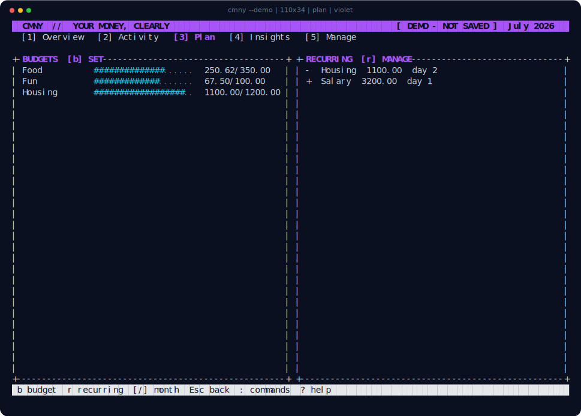

<div align="center">

<h1></h1>

**Your money, clearly.** A private money manager that lives in your terminal.

</div>


CMNY keeps income, expenses, accounts, transfers, plans, and savings in one
fast keyboard-friendly app. Everything stays on your computer—no account,
cloud, ads, or bank connection.

## Download

| Your computer | CMNY 1.0.0 |
|---|---|
| macOS 11 or newer | [Download for Mac](https://github.com/eduardtomas1/cmny/releases/download/v1.0.0/cmny-v1.0.0-macos-universal.tar.gz) |
| 64-bit Linux | [Download for Linux](https://github.com/eduardtomas1/cmny/releases/download/v1.0.0/cmny-v1.0.0-linux-x86_64.tar.gz) |
| Windows 10 or 11 | [Download for Windows](https://github.com/eduardtomas1/cmny/releases/download/v1.0.0/cmny-v1.0.0-windows-x86_64.zip) |

Extract the download, open a terminal in its folder, and try the disposable demo:

```sh
./cmny --demo
```

On Windows, use `.\cmny.exe --demo`. Run `./cmny` without `--demo` when you
want CMNY to save your changes automatically.

## What it does

- Tracks accounts, income, expenses, transfers, categories, and monthly savings
- Lets you add, edit, delete, search, filter, and safely undo changes
- Shows spending plans, trends, forecasts, and useful monthly insights
- Reconciles an account against a statement balance
- Offers five themes, mouse support, custom controls, and a built-in tutorial
- Makes rotating backups and moves your data with CSV files


## Everyday keys

| Key | Action |
|---|---|
| `1`…`5` | Overview, Activity, Plan, Insights, Manage |
| `a` / `v` | Add an entry / make a transfer |
| `e` / `d` / `u` | Edit, delete, undo |
| `/` / `f` / `c` | Search, filter, clear |
| `g` / `m` / `l` | Filter accounts, manage accounts, reconcile |
| `:` / `?` / `q` | Commands, help, quit |



## Keep your data safe

CMNY saves locally and creates automatic rotating backups. Use `cmny --db-path`
to find your ledger, `cmny --check` to check it, or `cmny --help` for backup,
restore, import, export, and portable-mode commands. The ledger is not encrypted,
so device encryption is recommended.

Downloads include [SHA-256 checksums](https://github.com/eduardtomas1/cmny/releases/download/v1.0.0/SHA256SUMS)
and [GitHub-signed build provenance](https://github.com/eduardtomas1/cmny/attestations).
CMNY is available under the [Apache License 2.0](LICENSE).
