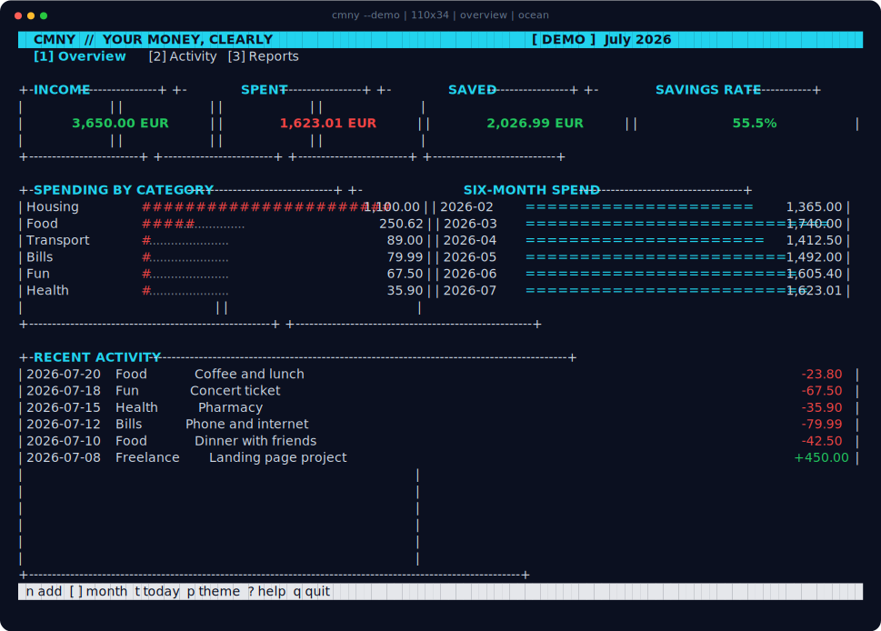
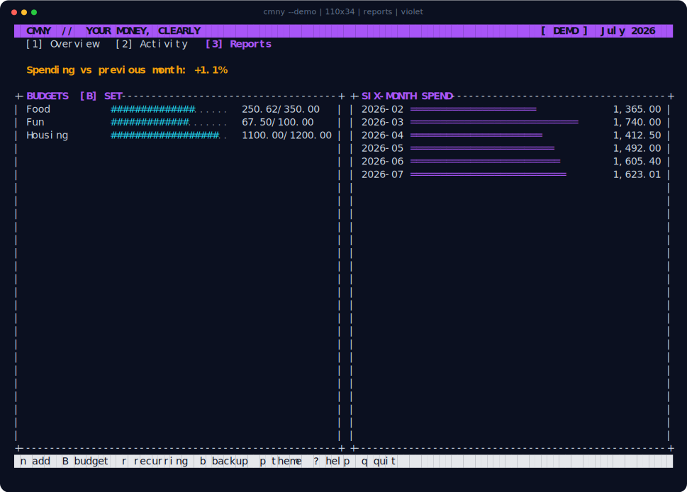
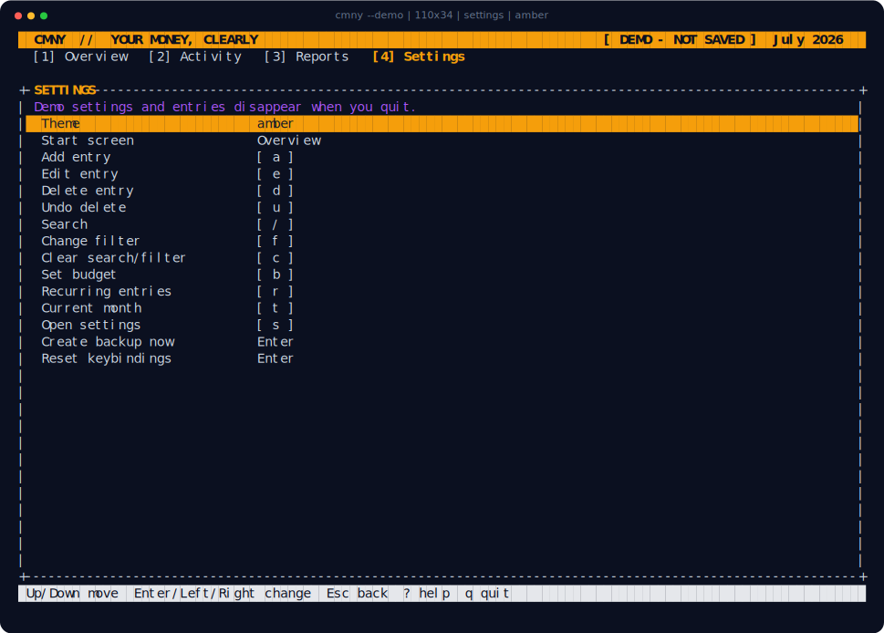

<div align="center">

# CMNY

**Your money, clearly.** A small, private money manager that lives in your terminal.

</div>



CMNY shows what came in, what went out, what you saved, and where your money is
going. It opens quickly, works entirely from the keyboard, and keeps everything
on your computer—no account, cloud, ads, or bank connection.

## Download and try it

| Your computer | Download |
|---|---|
| macOS 11 or newer | [CMNY for Mac](https://github.com/eduardtomas1/cmny/releases/download/v0.3.0/cmny-v0.3.0-macos-universal.tar.gz) |
| 64-bit Linux | [CMNY for Linux](https://github.com/eduardtomas1/cmny/releases/download/v0.3.0/cmny-v0.3.0-linux-x86_64.tar.gz) |
| Windows 10 or 11 | [CMNY for Windows](https://github.com/eduardtomas1/cmny/releases/download/v0.3.0/cmny-v0.3.0-windows-x86_64.zip) |

Extract the download, open a terminal inside its folder, and launch the sample
ledger:

```sh
./cmny --demo
```

On Windows, use `.\cmny.exe --demo`. The demo is completely disposable. When
you are ready to use your own data, run `./cmny` without `--demo`; CMNY saves
each change automatically.

## What you can do

- Add, edit, delete, and immediately undo deleted income or expenses
- See monthly totals, savings, categories, and a six-month trend
- Set spending budgets and reuse recurring entries such as rent or salary
- Search every month at once and filter income or expenses
- Choose Ocean, Violet, or Amber and make the controls your own
- Create backups, check your ledger, and move data with CSV files
- Resize the terminal without losing your work



## Everyday keys

| Key | What it does |
|---|---|
| `1` `2` `3` `4` | Overview, activity, reports, settings |
| `Tab` / `Shift+Tab` | Move between screens |
| `Esc` / `Backspace` | Go back or cancel |
| Arrow keys | Move through lists or change month |
| `a` | Add an entry |
| `Enter` | Open or use the selected item |
| `e` / `d` / `u` | Edit, delete, undo delete |
| `/` / `f` / `c` | Search, filter, clear |
| `b` | Set or remove a monthly budget |
| `r` | Open recurring entries |
| `s` | Open settings |
| `?` / `q` | Help, quit |

Open Settings to change the theme, choose your start screen, remap any action
key, reset the controls, or make a backup. CMNY remembers those choices and
saves real entries automatically. Demo changes are intentionally not saved.



## Keep your data safe

Use `cmny --db-path` to see where your ledger lives. You can also run:

```sh
cmny --backup my-backup.db
cmny --restore my-backup.db
cmny --export my-money.csv
cmny --import my-money.csv
cmny --check
```

Restores make a safety copy first, imports show a preview, and exports never
overwrite an existing file. Your ledger is private to your computer account,
but it is not encrypted, so device encryption is still recommended.

Downloads include [SHA-256 checksums](https://github.com/eduardtomas1/cmny/releases/download/v0.3.0/SHA256SUMS)
and [GitHub-signed build provenance](https://github.com/eduardtomas1/cmny/attestations).
CMNY is available under the [Apache License 2.0](LICENSE).
